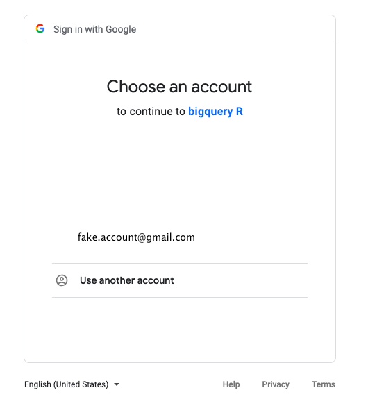
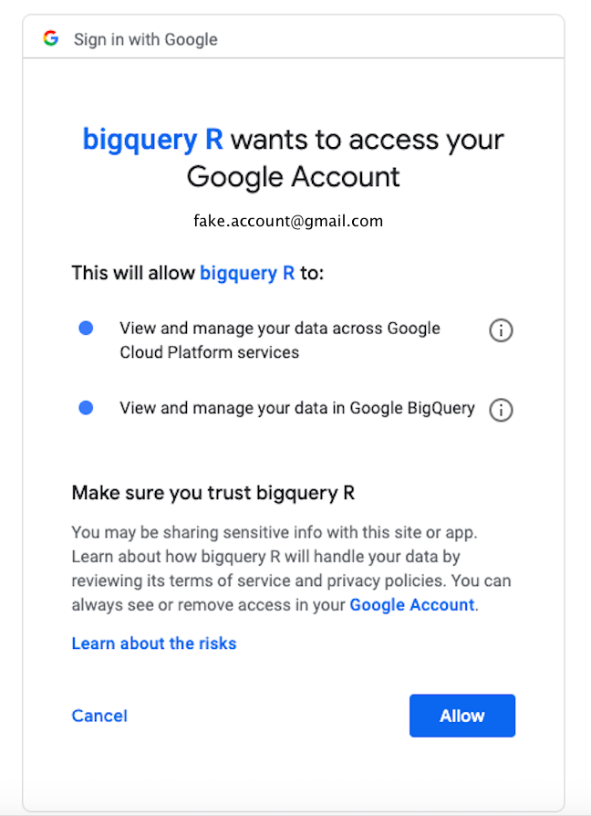
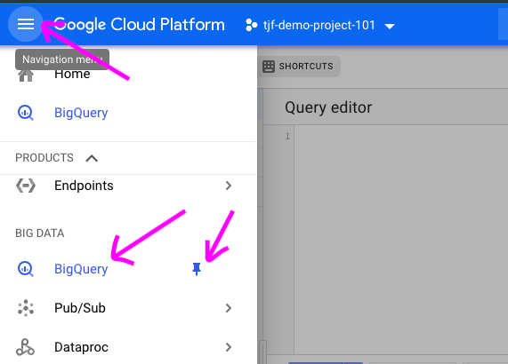
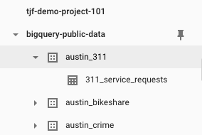
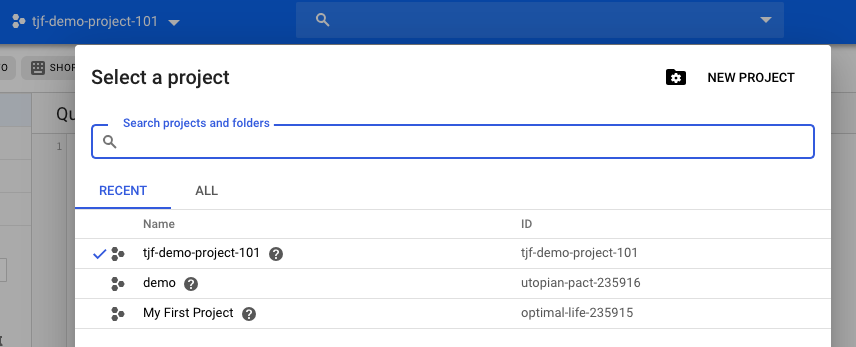
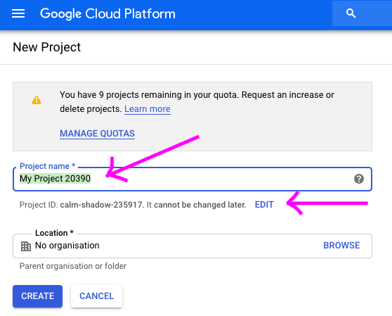

## Disclaimer

I've been using bigrquery for a few months and these materials comprise my pearls of wisdom and insights into the nuances of BQ that I have deemed useful to me and wish I'd had prior knowledge of. This is clearly not an exhaustive list.


## Intro 

These materials are aimed at people wanting to use the Low-level API funcitons in `bigrquery` in order to send SQL statements from R to BigQuery (BQ) and store results, collect meta data about the query/job etc. We do not go into details about using the DBI or dbplyr options. For more information see,

https://github.com/r-dbi/bigrquery

https://cran.r-project.org/web/packages/bigrquery/bigrquery.pdf


## Sign up for a free GCP account

In order to have a play with BQ you need an account; you can sign up for a GCP 12 month free trial. You get $300 USD of credit to experiment with, and since processing about 1TB of data costs about $5 USD this should last you some time. You do need to enter credit/debit card details, but do not fear, Google make it clear that they will not automatically start charging you as soon as your free credit runs out. (However, I accept no responsiblilty if they do).

https://cloud.google.com/free/

## Authentication

The first time you run a `bigrquery` function you may think nothing is happening (particularly if knitting in Rmd), until you notice this in appear in the console,


To agree to cache OAuth access credentials type "Yes". If you choose "No" then you will need to authenticate each time, which may be preferable. For more information on OAuth tokens and how to refrain from accidentally publishing them I found this vignette in the context of googlesheets helpful, 

https://cran.r-project.org/web/packages/googlesheets/vignettes/managing-auth-tokens.html


Whether you choose "Yes" or "No" either way the following will popup in a browser window. Choose an account which you have signed up to GCP with and continue. 



Next you will need to grant `bigrquery` access to BQ by clicking __Allow__. (not sure why it's referred to here as _bigquery R_)



Finally, if the authenitication is succesful you will get this,


comply.

## Navigating the BQ web UI

We briefly look at the BQ web User Interface (UI) to set up a project and get familiar with the basic layout. Note I am using the current, in beta, web UI and not the deprecating classic web UI.

To get to BQ click on the navigation menu and scroll down (a long way down) until you find BigQuery, now pin it, so it will appear at the top of the menu henceforth.  



<br>

Now look at the project you are currently working in, the project ___name___ appears at the top, and on the left is the list of project ___ID____s_ you have access to. I have also pinned the bigquery-public-data here (though due to it's location being "US" makes it difficult to use from non-US located projects).


If the project  has a little right facing triangular dropdown indicator then it has datasets  associated with it, which in turn will contain tables , for example



As you can see projects can contain many datasets, which can contain many tables.
<br>
<br>
To create a new project click on the project you are in and a popup to select or create a project will appear.



To create a new project click on __NEW PROJECT__ and enter a project name and if you want to also change the __ID__ be sure to do so now!



For more on the web UI see,

https://cloud.google.com/bigquery/docs/bigquery-web-ui


## Back to R/RStudio

OK, enough of the web UI, back to R and code.

### Load libraries

```r
library(tidyverse) #wrangling
library(DBI) #connecting
library(knitr) #knitting
library(bigrquery) #talking to BQ
library(gdata) #humanReadable byte conversion
```


## Functions we will explore

Below is detailed, but not necessarily exhaustive information on how to use the following `bigrquery` functions. To get the help page on any of these type `?` followed by the function name - `?bq_projects`.

`bq_projects`

`bq_dataset`, `bq_dataset_create`, `bq_dataset_exists` and `bq_project_datasets`

`bq_table`, `bq_table_upload` and `bq_table_exists`

`bq_project_query` and `bq_perform_query`

`bq_project_jobs`, `bq_job_status`, `bq_job_show_statistics`, `bq_job_meta`


### `bq_projects`

This function simply lists the project IDs you have access to. Project Name and ID are not neccessarily the same, ID must be unique across all of BQ. Using the web UI you create and name a new project; BQ will suggest a unique project ID, you can only edit at this point. Typically I make my project names and ID's the same to save (my) memory.


```r
bigrquery::bq_projects()
```

```
## Auto-refreshing stale OAuth token.
```

```
## [1] "utopian-pact-235916"  "optimal-life-235915"  "tjf-demo-project-101"
```
The first two are examples of BQ generated Project ID's and the final one I successfully edited to match the project name I chose. Project ID is used to locate a project so project name is not as important as far as running queries is concerned.

### `bq_dataset`, `bq_dataset_create`, `bq_dataset_exists` and `bq_project_datasets` 

We've set up a project via the web UI, now we can set up a dataset within that project. Let's call it "demo". We use `bq_dataset` inside `bq_dataset_create` to set the project (ID) and dataset name, creating a BQ dataset object. If the dataset name already exists you'll get a "duplicate" error, which I don't believe you can simply set to "overwrite". The next chunk has `eval=FALSE` in the code, you will want to remove this if running for the first time.

```r
#not run
bigrquery::bq_dataset_create(
  x = bq_dataset(project = "tjf-demo-project-101", dataset = "demo" )
  , location = "EU"
)
```

We can use `bq_dataset_exists` with ___project.dataset___ as a string to check if a table exists...


```r
bigrquery::bq_dataset_exists(x = "tjf-demo-project-101.demo")
```

```
## [1] TRUE
```

We can also use `bq_project_datasets` to list all the datasets that exists within a project, like so


```r
#check out the datasets in my project
bigrquery::bq_project_datasets(
  x = "tjf-demo-project-101"
)
```

```
## [[1]]
## <bq_dataset> tjf-demo-project-101.demo
```


```r
#check out a public project
bigrquery::bq_project_datasets(
  x = "bigquery-public-data"
  , page_size = 3 #default rows per page is 100
)
```

```
## Warning: Only first 3 results retrieved. Adjust with `max_pages` and
## `page_size` parameters.
```

```
## [[1]]
## <bq_dataset> bigquery-public-data.austin_311
## 
## [[2]]
## <bq_dataset> bigquery-public-data.austin_bikeshare
## 
## [[3]]
## <bq_dataset> bigquery-public-data.austin_crime
```


```r
#and a another similarly named, but completely different, public project
bigrquery::bq_project_datasets(
  x = "publicdata"
)
```

```
## [[1]]
## <bq_dataset> publicdata.samples
```

Note you get a warning if there are more datasets that are not displayed. Also note the two different public projects, ___bigquery-public-data___ and ___publicdata___. The first contains many many datasets and tables, mostly large. The second contains only one dataset, ___samples___.

### `bq_table`, `bq_table_upload` and `bq_table_exists`

Now I set up a table within my __demo__ dataset. I'm just going to upload a small table that exists within `dplyr` the wonderful __mtcars__. This means our project, dataset and tables that we're working in are all set up in the same location, in this case "EU". I had intended to do this demo using public datasets, of which there are many in __bigquery-public-data__, but as this has location "US" it makes things rather more tricky - it is much simpler if your data and projects are all within the same location. 
Similarly to creating a dataset we use `bq_table` inside `bq_table_upload` to create the BQ table object, and name it. Unlikes datasets, tables can be set to overwrite using the `write_disposition` argument.


```r
bigrquery::bq_table_upload(
  x = bq_table(project = "tjf-demo-project-101", dataset = "demo", table = "mtcars_copy")
  , values = mtcars #dataframe
  , quiet = "TRUE"
  , location = "EU"
  , write_disposition = "WRITE_TRUNCATE" #overwrite
)
```

Check it now exists...


```r
bigrquery::bq_table_exists(x = "tjf-demo-project-101.demo.mtcars_copy")
```

```
## [1] TRUE
```


### `bq_project_query` and `bq_perform_query`

Now we have some data to play with, let's send a simple SQL query and store the results as a new table, within the same project and dataset.


```r
project_id <- "tjf-demo-project-101"

#no need to specify project in from, just dataset.table
sql_query <- "select *
        from demo.mtcars_copy 
        limit 10"
destination_table <- "tjf-demo-project-101.demo.mtcars_10" #do specify project.dataset.table


bigrquery::bq_project_query(
  x = project_id #billing is automatically set to the project ID used
  , query = sql_query
  , destination_table = destination_table
  , write_disposition = "WRITE_TRUNCATE" #set table to overwrite if exists
  , quiet = TRUE #if FALSE displays a progress bar (1 line per sec), NA (default)
                 #only shows progress bar for long running jobs
)
```

```
## <bq_table> tjf-demo-project-101.demo.mtcars_10
```


```r
bigrquery::bq_table_exists(x = "tjf-demo-project-101.demo.mtcars_10")
```

```
## [1] TRUE
```

I've set `quiet = TRUE` above because otherwise you get a line per second in the output which can be irritating. If you look at the help, (run `?bq_project_query` in the console) you will see amongst the arguments listed `...` these are arguments that will be passed to `bq_perform_query`, such as `write_disposition`, `create_disposition`. For full information on these arguments see the help page `?bq_perform_query`. You may notice `use_legacy_sql = FALSE` by default, "legacy sql" in the GCP context is the first pseudo-SQL that they wrote for use in BQ, and subtley (frustratingly) different from Standard SQL. Fortunately they have now evolved to Standard SQL use. Their Standard SQL includes most, but not all functions you may be familiar with eg `LIMIT` exists but `TOP` doesn't, more info here,

https://cloud.google.com/bigquery/docs/reference/standard-sql/


### `bq_project_jobs`

This function lists the job IDs of all jobs that have been run within the specified project. A job can be any of ___load___, ___query___, ___upload___, ___extract___. Crucially it lists them __most recent first__ which is super useful - it means you can easily get the Job ID of the last job you ran and are then able to use this to get all sorts of meta data about that job.


```r
project_id = "tjf-demo-project-101"

bigrquery::bq_project_jobs(
  x = project_id
  , page_size = 3 #number of rows per page, default is 100
  , max_pages = 1 #default is 1
)
```

```
## Warning: Only first 3 results retrieved. Adjust with `max_pages` and
## `page_size` parameters.
```

```
## [[1]]
## <bq_job> tjf-demo-project-101.job_KXqfSR5jojZxMmrD7YOafWrsI3h-.EU
## 
## [[2]]
## <bq_job> tjf-demo-project-101.job_CpgapARFuOHDPKTBbri1fvbQs3p4.EU
## 
## [[3]]
## <bq_job> tjf-demo-project-101.job_0VMyFiVxnRkC8cm8MAoqdz4uZbps.EU
```

Lets also grab the last job ID and assign it so we can reference it later

```r
last_job_id <- bigrquery::bq_project_jobs(
    x = project_id
    , page_size = 1 #number of rows per page
    , warn = FALSE #warning unnecessary - I know I've only received 1 row!
)
```
And have a look at it,

```r
last_job_id
```

```
## [[1]]
## <bq_job> tjf-demo-project-101.job_KXqfSR5jojZxMmrD7YOafWrsI3h-.EU
```
<span style="background-color: #FFFF00">___Note that this is a list of a list, so to access the actual last job ID we need to ask for the following___</span>

```r
last_job_id[[1]]
```

```
## <bq_job> tjf-demo-project-101.job_KXqfSR5jojZxMmrD7YOafWrsI3h-.EU
```


For more on jobs see, 
https://cloud.google.com/bigquery/docs/reference/rest/v2/jobs

### `bq_job_status`

This function tells you if the job is done,

```r
bigrquery::bq_job_status(
  x = last_job_id[[1]]
)
```

```
## $state
## [1] "DONE"
```

### `bq_job_show_statistics`

This function gives you billing information, and possibly other information 

```r
bigrquery::bq_job_show_statistics(
  x = last_job_id[[1]]
)
```

```
## Billed: 10.49 MB
```

### `bq_job_meta`

Both of the previous functions actually call specifics parts of the complete (huge) list of meta data, which is available via `bq_job_meta`. I have reduced the output via the `fields` argument. To see the complete set of fields remove this line, or set `fields = NULL` (the default). The `fields` argument takes a string, comma separated, and with no spaces!

```r
bigrquery::bq_job_meta(
  x = last_job_id[[1]]
  , fields = "id,status,statistics/query/totalBytesProcessed,statistics/query/totalBytesBilled,status"
)
```

```
## $id
## [1] "tjf-demo-project-101:EU.job_KXqfSR5jojZxMmrD7YOafWrsI3h-"
## 
## $statistics
## $statistics$query
## $statistics$query$totalBytesProcessed
## [1] "2816"
## 
## $statistics$query$totalBytesBilled
## [1] "10485760"
## 
## 
## 
## $status
## $status$state
## [1] "DONE"
```

Looking at the output you can see how the information is nested in the hierarchy `object$array$element`, and that not all these are necessarily exist. For example `$id` is an object, with no array or elements beneath it (or is it an element with nothing above?). On the other hand `status` only has `state` below it.

To translate into something the `fields` argument can understand you essentially replace the `$`'s with `/`'s. For example `statistics$query$totalBytesProcessed` becomes `statistics/query/totalBytesProcessed` when referenced inside `bq_job_meta`. If you wanted to see all the elements of the `query` array in the `statistics` object, that is everythng under `statistics$query` you would use `statistics/query`. 

Note also that the order of the fields returned is the order they are in in the full output, not the order listed in the `fields` string.


## Bespoke Functions

If you are going to be using BQ in a pipeline, for example, for regular repeat anaylsis of annual data for which you may need to have some QA report, then you will most likely want to write your own functions to encapsulate the queries and output you want to see. The example below is a  modified version of a python function written by Kimberley Brett. `run_sql_query` runs the query, given the sql statement, and project, dataset, and table parameters and outputs some useful meta data in an easy to read format. 


```r
#define function
run_sql_query <- function(sql_query, project_id, destination_dataset, destination_table){
bigrquery::bq_project_query(
  x = project_id
  , query = sql_query
  , destination_table = paste(project_id, destination_dataset, destination_table, sep = ".") 
  , write_disposition = "WRITE_TRUNCATE"
  , quiet = TRUE
)
  
  last_job_id <- bigrquery::bq_project_jobs(
    x = project_id
    , page_size = 1 #number of rows per page
    , warn = FALSE #I know I've only received 1 row!
)

bigrquery::bq_job_status(last_job_id[[1]]) #get last job ID
job_meta_data <- bigrquery::bq_job_meta(
  last_job_id[[1]]
  , fields = "id,statistics/query/totalBytesProcessed,statistics/query/totalBytesBilled,status"
  )

#specify format of output
writeLines(c( #here using c("line1", "line2", "line3") easily makes new lines
  paste0("Job ID: ", job_meta_data$id)
  , paste0("Job status: ", job_meta_data$status$state)
  , paste0("Total processed: ", gdata::humanReadable(
  as.numeric(job_meta_data$statistics$query$totalBytesProcessed)
  , standard = "SI"
  ))
  , paste0("Total billed: ", gdata::humanReadable(
  as.numeric(job_meta_data$statistics$query$totalBytesBilled)
  , standard = "SI"
  ))
)
)

  
}
```

Example of this function in use

```r
#set parameters
sql_query = "select *
from demo.mtcars_copy
where cyl = 4 and mpg > 25"
project_id <-  "tjf-demo-project-101"
destination_dataset <- "demo"
destination_table <- "foo"


run_sql_query(
  sql_query = sql_query
  , project_id = project_id
  , destination_dataset = destination_dataset
  , destination_table = destination_table
)
```

```
## Job ID: tjf-demo-project-101:EU.job_RXOF_i58gvtNMHOFGvEePVYxnMQg
## Job status: DONE
## Total processed: 2.8 kB
## Total billed: 10.5 MB
```

_fin_

