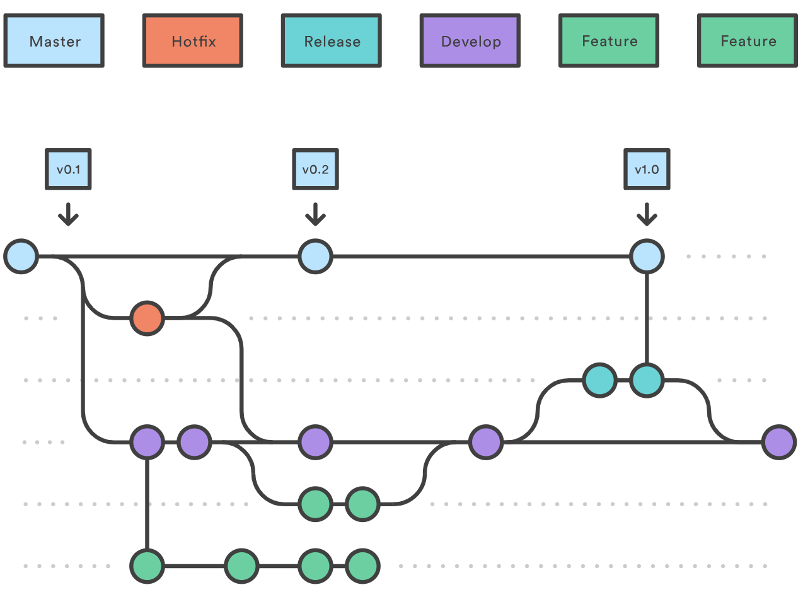
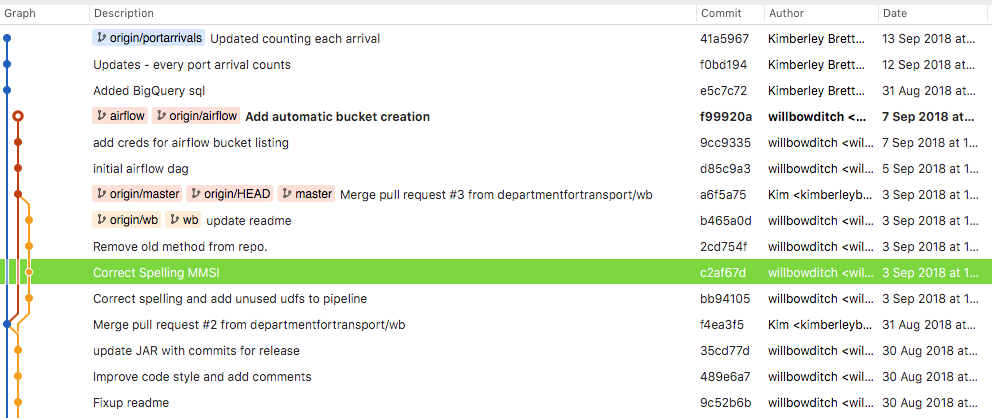
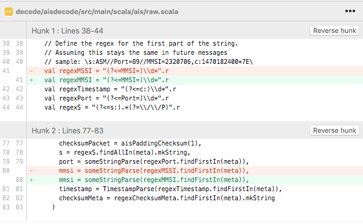
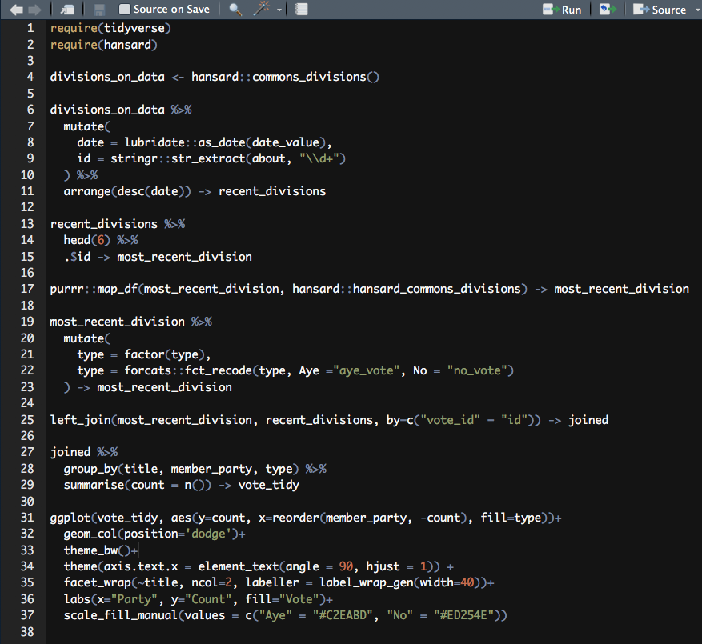
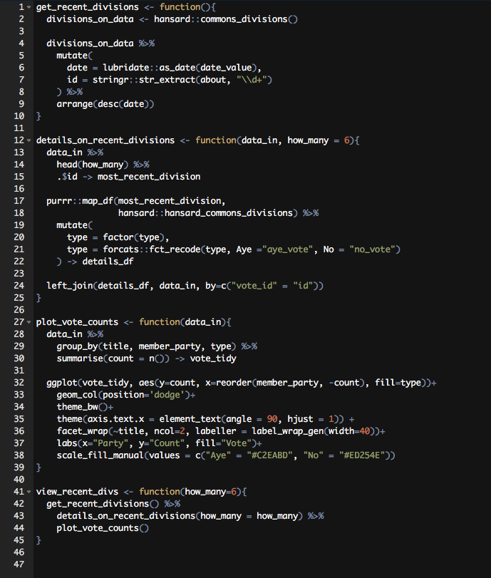
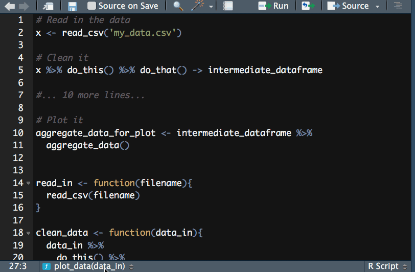
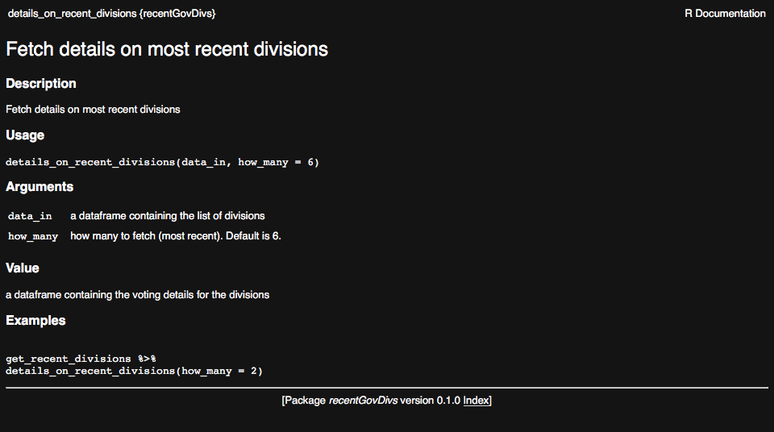
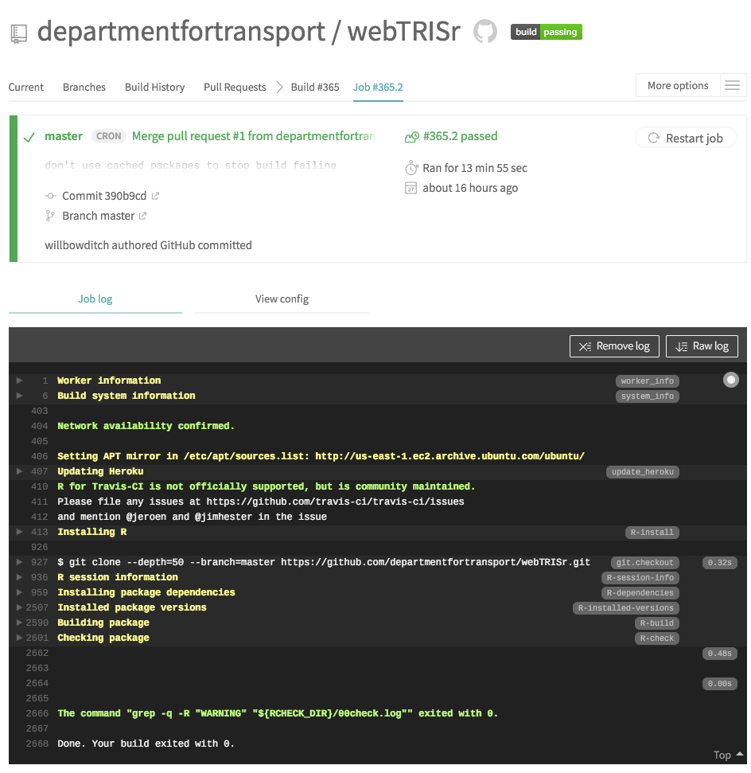

[Download folder](https://minhaskamal.github.io/DownGit/#/home?url=https://github.com/departmentfortransport/coffee-and-coding/tree/master/All_materials/20181010_Software_Dev_practices_in_R)

# Why use development tools? 


---


- As analysts we care about getting the right answer, so the code needs to be correct and maintainable
- Writing code can lead to lots of avoidable mistakes. There are a whole bunch of tools and practices from software development that can help to prevent them.

- The session will focus on **R** tools, but the same or similar tools are available in most languages
- We won't cover how to use them in depth, but _why_ you should use them, and where to find more information.

---

# Version Control and Collaboration 🤝

This might look familiar:
```
Analysis.R
Analysis_v2.R
Analysis_final.R
Analysis_finalfinal.R
```

- The problem becomes greater when you have multiple people working on the same file
- What happens if two users save two different versions at the same time?

---

## Git

- `git` is the most popular version control system, which simply tracks how code changes over time. 
- Code can be restored to any point in time and can be tagged 
  - (e.g. this is the version of the code used for release 2018)
- **Who** made the changes and **why** is recorded
- Working on the code at the same time is facilitated with 'branches' and 'merges'
- If something breaks, `git` has a number of tools to find out where the break occurred and revert to a previous version if necessary
- **`git`** is the client, **GitHub** is a repository hosting service. 


#### Resources

- [https://www.atlassian.com/git/tutorials](https://www.atlassian.com/git/tutorials)
- [http://swcarpentry.github.io/git-novice/](http://swcarpentry.github.io/git-novice/)
- [https://git-scm.com/book/en/v1/Git-Basics](https://git-scm.com/book/en/v1/Git-Basics)


---





- **Master** is the 'stable' branch of the code, the version that is used to produce the final output of a publication, for example. 
  - Versions are tagged (here with version numbers), so you know which version of the code was used for a particular task.
- **Features** are worked on in a separate branch and these features are integrated into a **development** branch (a work in progress)


---

## Example `git` commit log



Note that every change to the code includes, who made it, and when is recorded. 

---

## Example `git` difference log

How the code has changed is recorded at a granular level. 

Here the spelling of MMSI is the only change - but complex changes are recorded in the same way



---

## GitHub

- GitHub advocates a particular way to work using `git`, called 'Git Flow'.  
- The main addition is **pull requests**, which is simply a stage where others look at the changes you are proposing to introduce and can discuss them before they are merged. 
- This is where **QA** should happen.  

[https://guides.github.com/introduction/flow/](https://guides.github.com/introduction/flow/) 


---

# R Packages 📦

>In R, the fundamental unit of shareable code is the package. A package bundles together code, data, documentation, and tests, and is easy to share with others.

I'm going to try and persuade you that writing packages is worth the extra effort in the long run.

Everything you need to know about writing packages is here: 
[http://r-pkgs.had.co.nz/](http://r-pkgs.had.co.nz/)

---

## Scripts vs. Packages

Most people start off writing scripts, a common convention is to do something like this: 
```
01_Read_data.R
02_Process.R
03_Plot.R
```

This is good for quick projects, but prevents you from using a lot of the tools designed to make writing maintainable R code easy.

---

## Errors in R

**Q**: What happens if a statement fails part way through a script?

```r
mpg %>%
  filter(model == 'passat') -> mpg

mpg
```

```
# A tibble: 7 x 11
  manufacturer model  displ  year   cyl trans      drv     cty   hwy fl    class  
  <chr>        <chr>  <dbl> <int> <int> <chr>      <chr> <int> <int> <chr> <chr>  
1 volkswagen   passat   1.8  1999     4 manual(m5) f        21    29 p     midsize
2 volkswagen   passat   1.8  1999     4 auto(l5)   f        18    29 p     midsize
3 volkswagen   passat   2    2008     4 auto(s6)   f        19    28 p     midsize
```

---

**A**: In some (interactive) situations, `R` will print out an error and continue merrily on.

```r
mpg %>%
  filterz(model=='passat') -> mpg
```
```r
Error in filterz(., model == "passat") : 
  could not find function "filterz"
```
```r
mpg
# A tibble: 234 x 11
   manufacturer model      displ  year   cyl trans      drv     cty   hwy fl    class  
   <chr>        <chr>      <dbl> <int> <int> <chr>      <chr> <int> <int> <chr> <chr>  
 1 audi         a4           1.8  1999     4 auto(l5)   f        18    29 p     compact
 2 audi         a4           1.8  1999     4 manual(m5) f        21    29 p     compact
 3 audi         a4           2    2008     4 manual(m6) f        20    31 p     compact
```
This is obvious if you run the code line-by-line, but not if you have a large script and run the whole thing (as is often the case). 

---

## Solution: Packages of Functions

Write packages of **functions** - a function that fails will always stop the execution.

```r
only_passats <- function(data_in){
  data_in %>%
    filterz(model=='passat')
}

run_all <- function(){
  data(mpg)
  
  mpg %>% only_passats()
}

run_all()
```

```
 Error in filterz(., model == "passat") : 
  could not find function "filterz" 
```

---

## Modular code

Scripts can get long and unruly quickly. If well commented you can find which sections do what, but a script that is 100s of lines long is never going to be easy to read. 

For example, if you want to change part of a graph produced somewhere in the script - you're going to have to scan through a lot of text.



---

 

Instead, here we know `view_recent_divs()` is the main function of the package, and it's obvious that the plotting is handled in the `plot_vote_counts()` function. 

---

There's also a shortcut to jump between functions in R-Studio



---

Functions also encourage you to generalise the problem using parameters. Writing generalised functions is usually good as you are more likely to be able to use them again. 

```r
# Script with hard coded value
recent_divisions %>%
  head(6) %>%
  .$id -> most_recent_division

# Can become a function with a default value that can be changed
details_on_recent_divisions <- function(data_in, how_many = 6){
  data_in %>%
    head(how_many) %>%
    .$id -> most_recent_division
}
```

---

## Function documentation

R has a framework for documenting functions and managing exports: `roxygen2`.


---

On build this becomes part of the documentation. 

So running ` ?details_on_recent_divisions` brings up: 




---

## Package metadata

- Packages have a `DESCRIPTION` file, that contains information for the package. 
  - Who maintains it, what packages are needed for it to work (`Imports:`)
  - This is mostly required for publishing packages on CRAN, but can be useful anyway. [http://r-pkgs.had.co.nz/description.html](http://r-pkgs.had.co.nz/description.html) 

```yaml
Package: recentGovDivs
Type: Package
Title: What the Package Does (Title Case)
Version: 0.1.0
Author: Who wrote it
Maintainer: The package maintainer <yourself@somewhere.net>
Description: More about what it does (maybe more than one line)
    Use four spaces when indenting paragraphs within the Description.
License: What license is it under?
Encoding: UTF-8
LazyData: true
RoxygenNote: 6.1.0
Imports:
    ggvis (>= 0.2),
    dplyr (>= 0.3.0.1)
```

- Documentation on how to use a package should take the form of a Vignette: [http://r-pkgs.had.co.nz/vignettes.html](http://r-pkgs.had.co.nz/vignettes.html ) 

  - Vignettes are just markdown documents that go through the use of a package. 
  - This way the instructions are part of the package

---

## Explicit function calls

This is a good idea in your scripts too. 

- One of the problems with R is that package imports are not explicit (unlike, `python` for example)
- When you issue `require(dplyr)` all of the functions from `dplyr` are brought into the 'namespace'
- What happens if you have two packages with the same function name? Which one will R choose?
- [It depends on the order of your `require` statements](https://peytonmccullough.com/post/resolving-name-conflicts-in-r/), but the real solution is to use explicit function calls.

Instead of using `require()` or `library()` use explicit function calls:

```R
iris %>%
	dplyr::group_by(Species) %>%
	dplyr::summarise(mean_sep_length = base::mean(Sepal.Length))
```

This is very verbose, but does mean you will always be calling the correct function. 

---

## Packrat: Saving package versions with

- Another problem is keeping the exact packages you used to produce a piece of analysis. 
- For a analysis to be reproducible, you need to make sure the environment remains the same

```R
packrat::init()  # Start using packrat for a project.

# Anything installed from this point forward will be monitored by packrat
```

Check on status of packrat:

```r
packrat::status()

The following packages are tracked by packrat, but are no longer available in the local library nor present in your code:
              _      
    pushoverr   0.1.3
```

You can save all the versions you've used by:

```r
packrat::bundle() # Create a sharable .tar.gz
packrat::snapshot() # Save the current state of the library (but without the .tar.gz)
```

### Resource

 [http://rstudio.github.io/packrat/](http://rstudio.github.io/packrat/)

---


# Tests, style, & automation 🤖

- Going to go through some tools that help you write good code, test the code, and automate the whole process. 
- If packages are used, implementing these tools is very straightforward. 

---


## The lintR package

> Good coding style is like using correct punctuation. You can manage without it, but it sure makes things easier to read. [http://r-pkgs.had.co.nz/style.html](http://r-pkgs.had.co.nz/style.html)

```r
# Good
average <- mean(feet / 12 + inches, na.rm = TRUE)

# Bad
average<-mean(feet/12+inches,na.rm=TRUE)
```

- It's hard to keep these in mind when writing code. The more you follow them, the better you'll get at using them from the start. 
- The `lintR` package checks scripts and packages for style errors and (some) actual code errors, like bad imports.

```r
lintr::lint('filename.R')
lintr::lint_package()
```


---

## Unit tests: `testthat`

One of the best ways to make sure your code does what you think it does it to write tests. 

Tests are typically separated into **unit tests** and **integration tests**. 

- Unit tests - check individual sections of code 
- Integration tests - check that different units of code work together 

Here's a simple unit test: 

```r
context("String length")
library(stringr)

test_that("str_length is number of characters", {
  expect_equal(str_length("a"), 1)
  expect_equal(str_length("ab"), 2)
  expect_equal(str_length("abc"), 3)
})
```

An example integration test might take some raw data and check the final output matches a known output (like last years figures).

---

## Code Coverage: `covr`

```R
covr::report()
```


- Reports how much of your code is checked by tests. 
- Not everything will need a check, but a good number to aim for is >75%. 

---


## The `goodpractice` package

- This only works on packages, but automatically checks for a lot of common mistakes and encourages good practices (lintR and covR are run as part of this)

```r
> goodpractice::gp()
It is good practice to
  ✖ write unit tests for all functions, and all package code in general. 0% of code lines are covered by test cases.

    R/recent_divisions.R:2:NA
    R/recent_divisions.R:4:NA
    R/recent_divisions.R:5:NA
    R/recent_divisions.R:6:NA
    R/recent_divisions.R:7:NA
    ... and 25 more lines

  ✖ add a "URL" field to DESCRIPTION. It helps users find information about your package online.
    If your package does not have a homepage, add an URL to GitHub, or the CRAN package package page.
  ✖ add a "BugReports" field to DESCRIPTION, and point it to a bug tracker. Many online code hosting services provide bug trackers for free, https://github.com, https://gitlab.com, etc.
  ✖ fix this R CMD check ERROR: Namespace dependency not required: ‘magrittr’ See section ‘The
    DESCRIPTION file’ in the ‘Writing R Extensions’ manual.
```


---


## Continuous Integration and Development

- All of the above steps should be run on any code that is changed before it is merged into the 'master version'
- This can be quite time consuming:
  - get the code ➡️ load up R ➡️ run test tests ➡️ see if they pass ➡️ repeat as needed 🔁
- CI/CD tools aim to do this for you and most of them plugin to to GitHub. 
  - For example, you can [setup rules](https://help.github.com/articles/about-protected-branches/), that all tests must pass before code can be added into the master version. 
- You can also use them to check if your package will work with new versions of packages and R
- Travis is free for open source projects: [https://docs.travis-ci.com/user/languages/r/](https://docs.travis-ci.com/user/languages/r/ ) 



---

## That's it 😀

Any questions? 

Content of these slides available at:

 [https://github.com/departmentfortransport/coffee-and-coding](https://github.com/departmentfortransport/coffee-and-coding)
